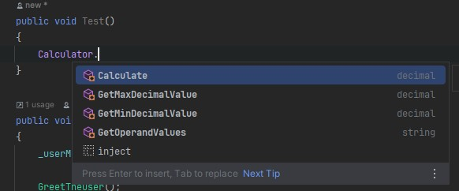
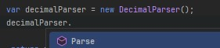

# **CALCULATOR LIBRARY**

### 1. GENERAL INFO
This is a demo calculator library.


### 2. REQUIREMENTS
See [CalculatorLib.csproj](./CalculatorLib.csproj) for target framework and dependencies.

### 3. FORKING

https://github.com/drago1979/CalculatorLib
### 4. INSTALLATION - via NuGet package

1. Create NuGet.config file in your solution/project:

```xml
<?xml version="1.0" encoding="utf-8"?>
<configuration>
  <packageSources>
    <add key="github" value="https://nuget.pkg.github.com/drago1979/index.json" />
  </packageSources>
  <packageSourceCredentials>
    <github>
      <add key="Username" value="YOUR_GITHUB_USERNAME" />
      <add key="ClearTextPassword" value="YOUR_GITHUB_PERSONAL_ACCESS_TOKEN" />
    </github>
  </packageSourceCredentials>
</configuration>
````  

    ⚠️ Replace: YOUR_GITHUB_USERNAME with your username.
    ⚠️ Replace: YOUR_GITHUB_PERSONAL_ACCESS_TOKEN with a GitHub token that has at least the read:packages scope.
    ⚠️ Warning: Exclude the NuGet.config from versioning to keep your GitHub token safe.

2. Install the Package
After adding the source, run:
```bash
dotnet add package CalculatorLib --version 1.0.1
```
### 4. INSTALLATION - via Source Code
1. Clone the repository:
``` bash
git clone https://github.com/drago1979/CalculatorLib.git
```
2. Copy the CalculatorLib directory into your solution folder or add it as an existing project.

3. Add a project reference from your main project to CalculatorLib:
``` bash
dotnet add <YourProject>.csproj reference CalculatorLib/CalculatorLib.csproj
```

### 6. HOW TO USE THE LIBRARY - NuGet package

#### => Include it in file
```csharp
using CalculatorLib;
```

#### => Most of generally-needed methods can be found in Calculator class.




Besides that, some other classes also have public methods in case you choose to access them directly. Eg:



#### 6.1 GET ALLOWED VALUES

```csharp
    Calculator.GetMaxDecimalValue(),
    Calculator.GetMinDecimalValue(),
    Calculator.GetOperandValues()
```

#### 6.2 PARSE USER INPUT
```csharp
    public void ParsersExample()
    {
        // Using Calculator class
        Calculator.ParseDecimal("3");
        Calculator.ParseOperand("+");
        
        
        // Using Parser classs
        var decimalParser =  Calculator.GetDecimalParser();
        decimalParser.Parse("9");
        
        var operandParser =  Calculator.GetOperandParser();
        decimalParser.Parse("9");
        
    }
````    

#### 6.3 PERFORM CALCULATION
```csharp
    public void CalculationExample()
    {
        var num = Calculator.ParseDecimal("3");
        var operand = Calculator.ParseOperand("+");
        
        var result = Calculator.Calculate(num, num, operand);
    }
```

#### => Additional details can be found in source code.
